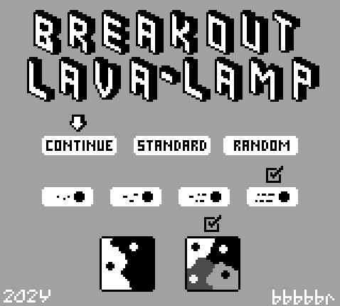
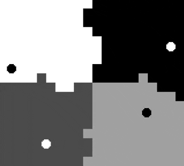

# Breakout Lava Lamp for the Game Boy / Analogue Pocket / MegaDuck

A chill, endless breakout-style lava lamp for the Game Boy inspired by this post: https://mastodon.gamedev.place/@vnglst@hachyderm.io/111828811846394449
- Which was apparently inspired by: https://twitter.com/nicolasdnl/status/1749715070928433161
- And perhaps also from: https://twitter.com/CasualEffects/status/1390290306206216196

### Download
The ROM can be downloaded from [itch.io](https://bbbbbr.itch.io/breakout-lava-lamp)

### Save Data
The play field will maintain state after being powered off (save to cart RAM) and can resume or start fresh after being powered on.

It's best to power off while in Tile Screen Menu instead of during game play.

#### FAQ
Q: Will the play field ever reach a steady state?
A: In order to make the outcome more interesting (and less symmetrical) the angle of a ball gets slightly modified each time it bounces. So it should never really stabilize.

### Supported consoles:
 - Game Boy / Game Boy Color (.gb)
 - Analogue Pocket (.pocket)
 - MegaDuck / Cougar Boy (.duck)

### Title Screen Menu
Actions:
- Continue: Resume the previous play field that was in progress
- Standard: Start a new play field with the standard, fixed random seed value
- Random: Start a new play field with a random seed value derived from user button presses

Controls:
- D-Pad: Moves cursor on title screen
- Start/A: Exits Title Screen

### Game Play Field Title
Controls:
- Select: Run faster while pressed
- Start/A: Return to Title Screen Menu

### Building
Requires GBDK-2020 4.2.0

